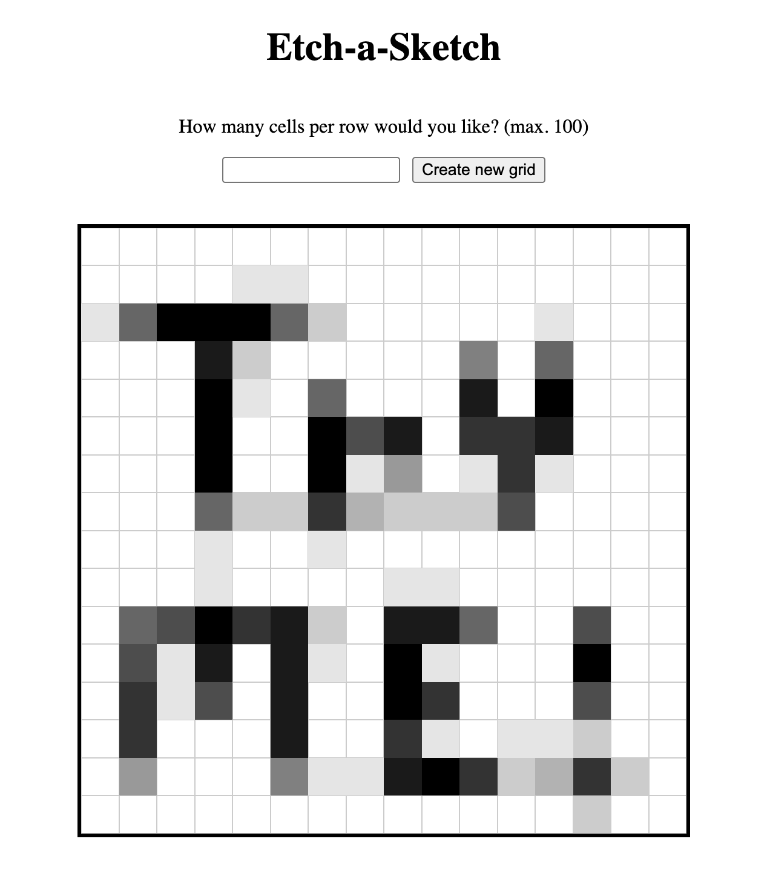

# Etch A Sketch Project
Create a square grid that lets users draw pixelated, grayscale artwork (similar to how an Etch A Sketch works). Users can optionally specify how many cells per row/column they would like in a new grid.

Visit [this link](https://mr-rhombus.github.io/odin-etch-a-sketch/) to put your artistic skills on display!

